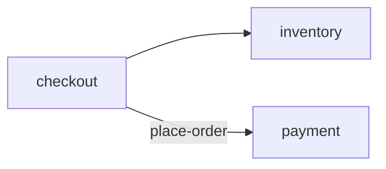

# Top-level README template (projection)

The repo-root `README.md` is an **optional** human on-ramp to the system. It is a **projection of
the specs, not a source of truth** — the per-BC `package-info` docs (and the system doc) stay
authoritative; the README only renders a human-readable view *over* them, the repo-altitude analog
of how `javadoc` publishes each BC's `package-info`. Add it only when a human on-ramp helps; a
one-BC scratch project needs none.

It has two slices, handled oppositely:

- **Generated** — everything derivable from the specs (charter, vision, the BC map, and a Mermaid
  diagram of the declared `## Components` wiring). Regenerated on `apply`; **never hand-edited**.
- **Hand-maintained** — only what *no spec covers*, so it cannot drift from one: project-local
  standards, build/run/test, free-form meta, and the free-form **inception seed** (motivation,
  domain, intent) that `/sbce new` reads.

Rules for filling it in:

- **Projection, not source (the generated block).** Never hand-write capability, charter, vision, or BC content **into the generated block** — that lives in the specs and is projected here; hand-typing it there recreates the drift SBCE bans (*"the gap is read, not stored"*).
- **Doubles as the seed.** The hand-written sections outside the markers are the free-form inception **seed** `/sbce new` (no argument) reads to bootstrap vision + specs. Rich vision/intent framing is welcome here — it *seeds* the distilled `## Vision`, it isn't the canonical line. SBCE reads the seed, never rewrites it; once specs exist they are the source of truth.
- **The generated slice is fenced** by `<!-- sbce:generated:start -->` / `<!-- sbce:generated:end -->`. `apply` replaces only what is between the markers and preserves everything outside. **No markers → `apply` leaves the README untouched** — a README is opt-in, never forced.
- **Generated content** = the system doc's **Charter** + **Vision** (if present) + a **BC map** (each BC name, its `>` responsibility one-liner, and a link to its `package-info`) + a **Mermaid `## Components` diagram**. Read from the per-BC docs and the system doc — the *"mark it generated, regenerate it"* rule made concrete at repo altitude.
- **Components diagram — projection, never inference.** Render only the *declared* wiring in the system doc's `## Components` (allowed calls + integration events) as a Mermaid graph: nodes are BCs, edges the declared directed relationships. **Never infer edges by scanning code** — that is drift-prone discovery, not projection. No `## Components` (a one-BC system) → nodes only, or omit the diagram. Basic Mermaid `flowchart`/`graph` syntax (version-stable, corpus-dense); delegate diagram style to `/mermaid` or `/bce-diagrams`.
- **Hand-maintained content** = only what no spec covers:
  - **`## Conventions`** — project-local, non-behavioral standards (coverage target, "money is always cents", review policy). **Declared, not verified**: not EARS, no `Sn`, not checked by the test oracle — binding team *policy*, distinct from Vision (aspiration) and from a `System invariant` (which must be behavioral *and* tested).
  - **Build / run / test** — delegate to the composed stack skill; it owns the commands.
  - Free-form meta — license, links, motivation.

The Markdown body (plain Markdown at the repo root — no `///`, no `package` line):

````markdown
# <System Name>

<!-- sbce:generated:start — projection of the specs; do not edit; `apply` regenerates from the system doc + per-BC package docs -->
> Turn a browsing customer into a fulfilled, paid order.

**Vision:** Make checkout so fast the customer never abandons a cart.

## Capabilities
- **checkout** — accept a cart and turn it into a confirmed, cancellable order · [`spec`](src/main/java/airhacks/checkout/package-info.java)
- **inventory** — track and reserve stock · [`spec`](src/main/java/airhacks/inventory/package-info.java)

## Components
<!-- projection of the system doc's ## Components wiring; nodes = BCs, edges = declared calls/events; never inferred from code -->

<!-- sbce:generated:end -->

## Conventions
<!-- hand-maintained; project-local, non-behavioral standards no spec covers; declared, not verified — no Sn, no test -->
- Money is always integer cents.
- Every PR needs two reviews and ≥90% line coverage.

## Build & run
<!-- delegate to the stack skill; it owns the commands -->
See the composed stack skill for build, run, and test commands.

## License
MIT
````
