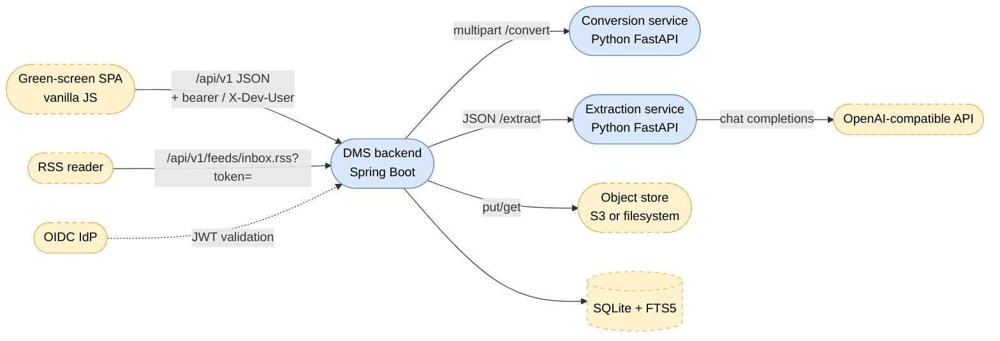
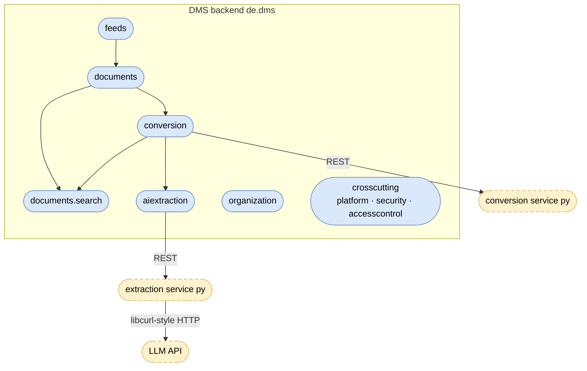
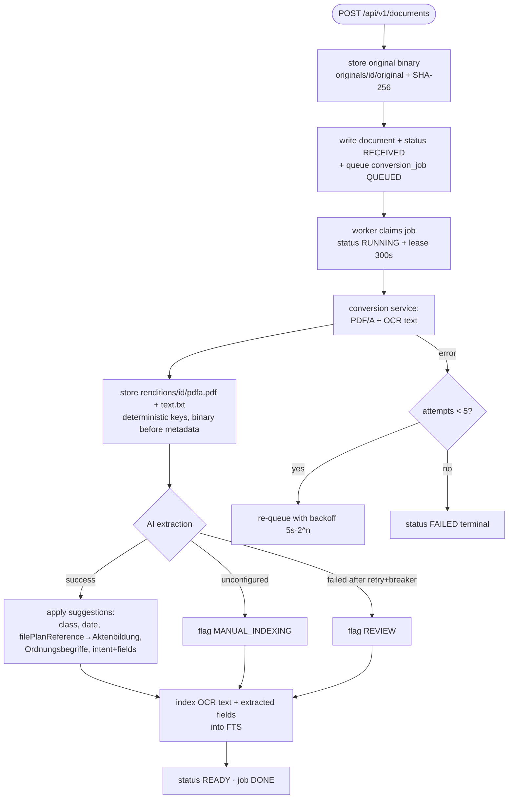

# Cloud DMS — As-Is Architecture (reverse-engineered)

> Reverse-engineered from the code on 2026-07-17 (iteration 1 of the COBOL migration —
> documentation only). This document describes the system **as it is today** (Java +
> Python + JS). The migration target is described in
> [`TARGET-ARCHITECTURE.md`](TARGET-ARCHITECTURE.md).

## 1. Introduction and goals

The Cloud DMS ingests business documents (PDF, DOCX, images, e-mail), normalizes them
to PDF/A with OCR, optionally extracts metadata with an LLM, files them into `Akten`
(case files), and makes them searchable — all scoped by an org-unit hierarchy with
role-based access control and a full audit trail.

Primary quality goals visible in the code:

| Goal | Evidence |
|------|----------|
| Durability first | Binary stored before metadata; storage down ⇒ 503, no orphans (`Ingestion`, R-1) |
| Graceful AI degradation | Unconfigured/failing AI never blocks ingest (`MetadataExtraction`, QG-1) |
| Idempotent processing | Deterministic storage keys; reprocess overwrites (`JobDispatcher`, R-2) |
| Auditability | Every access decision auditable; audit rows survive user deletion |
| Operability | Health probes (db, objectStore, worker), hourly backups, retry/backoff |

## 2. Constraints

- Single-node deployment: SQLite (WAL) as the only database; one in-process worker.
- Deployment target: Docker containers (one Hugging Face Space per container in
  production, `docker-compose` locally); TLS terminated by the platform proxy.
- The two Python document services are separate containers reached via HTTP with a
  shared static bearer token (`DMS_SERVICES_TOKEN`).
- Upload limit 100 MB (`dms.upload.max-bytes`, Spring multipart 100/105 MB).

## 3. Context

## 4. Solution strategy (as-is)

- **BCE architecture** (`de.dms.<bc>.<boundary|control|entity>`): boundary =
  REST controllers/facades/HTTP clients, control = domain logic, entity = JPA
  entities + repositories.
- **Durable job queue in the database** (`conversion_job` table) drained by an
  in-process scheduler-driven worker — no message broker.
- **Search as a projection**: FTS5 virtual table fed by the indexer; rebuildable from
  object-store text renditions; ACL predicate pushed into the search query.
- **Config over code**: extraction catalogs (classes, intents, Ordnungsbegriff types)
  live in DB tables, editable in the Admin UI, and travel with every extraction request.

## 5. Building block view

### 5.1 Business components

| BC | Responsibility | Key classes |
|----|----------------|-------------|
| `documents` | Upload/ingest, document CRUD, metadata + validation, `Akten`, document classes, controlled vocabulary, config for the UI | `DocumentsController`, `Ingestion`, `MetadataValidation`, `Aktenbildung`, `AktenController`, `DocumentClassesController`, `ConfigController` |
| `documents.search` | FTS indexing and ACL-filtered querying | `SearchIndexer`, `SearchQuery`, `SearchController` |
| `conversion` | Durable job queue, worker loop, HTTP client to the conversion service, jobs REST | `JobQueue`, `JobDispatcher`, `ConversionServiceClient`, `JobsController` |
| `aiextraction` | Extraction catalogs (intents + fields, Ordnungsbegriff types), suggestion orchestration with retry/circuit-breaker, HTTP client to the extraction service | `MetadataExtraction`, `IntentCatalog`, `OrdnungsbegriffCatalog`, `ExtractionServiceClient` |
| `feeds` | RSS inbox feed, hashed feed tokens | `InboxFeed`, `FeedTokens`, `FeedsController` |
| `organization` | Org-unit hierarchy (path-based), users, memberships, JIT user provisioning | `Hierarchy`, `Enrollment`, `UserProvisioning`, `OrgsController`, `UsersController`, `MembersController` |
| `crosscutting.platform` | Object store (S3/filesystem), error mapping, paging, config, bootstrap, backup, health | `ObjectStore`, `ApiExceptionHandler`, `Backup`, `Bootstrap` |
| `crosscutting.security` | `oidc`/`dev` auth modes, current user | `SecurityConfig`, `DevAuthFilter`, `CurrentUser` |
| `crosscutting.accesscontrol` | Role checks with hierarchy inheritance, audit trail | `Authorization`, `AuditTrail`, `Role` |

### 5.2 Python services

| Service | API | Behavior |
|---------|-----|----------|
| `services/conversion` | `POST /convert` (multipart `file`, `mimeType`; bearer service token), `GET /healthz` | Normalizes to PDF/A + OCR via ocrmypdf/ghostscript/libreoffice, extracts text via pdftotext. Returns `{pdfBase64, text, producer, ocrApplied}`. Producers: `ocrmypdf`, `ghostscript`, `libreoffice`, `passthrough` (no toolchain — PDF stored unnormalized). Errors: 504 `timeout`, 422 `conversion_failed`. |
| `services/extraction` | `POST /extract` (JSON; bearer service token), `GET /healthz` | Builds system prompt from request catalogs, calls `{DMS_AI_URL}/chat/completions` with `response_format: json_object`, model `DMS_AI_MODEL`. Document transport per `DMS_AI_DOCUMENT_MODE`: `text` (default; OCR text, capped 100 000 chars) or `file` (inline PDF); images always as data-URL `image_url`. Returns `{status:"ok", suggestions}` or `{status:"unconfigured"}` (no `DMS_AI_TOKEN` — 200, not an error). Errors: 422 `no_text`, 502 `upstream_ai_error` (network, non-2xx, unparseable answer). |

### 5.3 Frontend

Vanilla-JS SPA (`dms/src/main/resources/static/`): app shell with sign-in overlay and
off-canvas mobile sidebar; views as ES modules (`documents`, `upload`, `search`,
`akten`, `jobs`, `admin`, `feed`) exposing `{title, render(root, ctx)}`; per-view
polling via a scheduler that cancels on navigation; REST access in `api.js`.

## 6. Runtime view — ingest pipeline

Worker semantics (`JobQueue`/`JobDispatcher`, config `dms.worker`): poll every 2 s,
batch 2 jobs per round (sequential), lease 300 s, max 5 attempts, backoff base 5 s;
a sweeper re-queues jobs whose lease expired (crashed worker). Reprocess
(`POST /documents/{id}/reprocess`) re-queues idempotently. Status transitions:
`RECEIVED → CONVERTING → READY | FAILED`.

## 7. Deployment view

- Local/CI: `docker-compose.yml` — three containers (`dms` on :7860, `conversion`,
  `extraction`), dev auth, healthcheck-gated startup. `compose.uat.yml` for UAT.
- Production: one Hugging Face Space per container; shared service token from Space
  secrets; TLS + `X-Forwarded-*` honored (`forward-headers-strategy: framework`).
- Data dir `DMS_DATA_DIR` (default `./data`) holds `dms.db`; object store is S3-compatible
  when `DMS_BUCKET_ENDPOINT` is set, else local filesystem under the data dir.
- Hourly `Backup` snapshots the SQLite DB to the bucket, keeping the newest 72.

## 8. Cross-cutting concepts

### 8.1 Security

- Mode `oidc` (default, fails fast without issuer): Spring OAuth2 resource server
  validates bearer JWTs from `SPRING_SECURITY_OAUTH2_RESOURCESERVER_JWT_ISSUER_URI`.
- Mode `dev` (explicit opt-in): `DevAuthFilter` trusts the `X-Dev-User` e-mail header;
  the SPA's sign-in overlay simply sets this header.
- Users are provisioned just-in-time on first request (`UserProvisioning`);
  `DMS_BOOTSTRAP_ADMINS` e-mails become admins of the root org unit at bootstrap.
- Service-to-service: static bearer `DMS_SERVICES_TOKEN` checked by both Python services.
- Feed access: token query parameter, HMAC-hashed with `DMS_FEED_TOKEN_SECRET`
  (oidc mode refuses the default secret), TTL 90 days, revocable.

### 8.2 Authorization & audit

Roles `ADMIN`/`EDITOR`/`VIEWER` per org unit (`membership`), inherited **down** the
hierarchy via the materialized `org_unit.path`. Checks live in
`accesscontrol.Authorization`; every decision can be written to `audit_log_entry`
(action READ/WRITE/DELETE, effect ALLOW/DENY, no FK to users). Search pushes the
set of visible org units into the FTS query itself (S-1).

### 8.3 Resilience

`resilience4j` on the AI path only: retry `ai` (3 attempts, 1 s wait) + circuit
breaker (window 10, 50 % failure, 30 s open) with fallback ⇒ `Outcome.failure()` ⇒
document flagged `REVIEW`. Conversion has no breaker: it is mandatory, failures ride
the job queue's retry/backoff.

### 8.4 Object store

`ObjectStore` interface with `S3ObjectStore` (sync AWS SDK client) and
`FilesystemObjectStore`; `StorageUnavailableException` ⇒ 503. Keys:
`originals/{docId}/original`, `renditions/{docId}/pdfa.pdf`, `renditions/{docId}/text.txt`.

## 9. Data model (SQLite, Flyway V1–V5)

Timestamps are epoch millis (INTEGER); `document_date` is ISO `yyyy-MM-dd`.

| Table | Key / notable columns | Purpose |
|-------|----------------------|---------|
| `org_unit` | `id`; `parent_id`, unique materialized `path` | Hierarchy |
| `dms_user` | `id`; unique `email`, `status` INVITED/ACTIVE/DISABLED | Users |
| `membership` | `id`; unique (`user_id`,`org_unit_id`), `role` | RBAC |
| `document` | `id`; `org_unit_id`, `uploaded_by`, `ingest_date` | Core record |
| `document_status` | `document_id`; `status` RECEIVED/CONVERTING/READY/FAILED | State |
| `rendition` | `id`; unique (`document_id`,`type`) ORIGINAL/PDF_A/TEXT, `storage_key`, `checksum_sha256`, `producer` | Binaries |
| `akte` | `id`; unique `file_plan_reference`, `org_unit_id` | Case files |
| `document_metadata` | `document_id`; `document_date`, `document_class`, `extracted_by_ai`, `indexing_flag` MANUAL_INDEXING/REVIEW, optimistic `version` | Metadata |
| `document_file_plan_reference` | `document_id`; `file_plan_reference`, `akte_id` | Akte link |
| `document_ordnungsbegriff` | `id`; unique (`document_id`,`type_name`,`value`); `type_name` is a snapshot, deliberately no FK | Extracted identifiers |
| `document_intent` | `document_id`; `name`, `fields_json` (display-only JSON) | Detected intent |
| `conversion_job` | `id`; `status` QUEUED/RUNNING/DONE/FAILED, `attempts`, `available_at`, `lease_until`, `last_error` | Job queue |
| `document_class` | `id`; unique `name` (RECHNUNG…SONSTIGES seeded) | Vocabulary |
| `extraction_intent` / `extraction_intent_field` | intent + fields (reserved JSON keys rejected) | AI catalog |
| `ordnungsbegriff_type` | `id`; unique `name`, `active` | AI catalog |
| `feed_token` | `id`; unique `token_hash`, `revoked_at` | Feed auth |
| `audit_log_entry` | `id`; `user_id` (no FK), action, effect, `source_ip` | Audit |
| `document_fts` | FTS5: `name`, `document_class`, `file_plan_reference`, `content_text`; unindexed `document_id`, `org_unit_id` | Search |

## 10. REST API inventory (`/api/v1`)

| Method & path | Purpose |
|---------------|---------|
| `POST /documents` | Multipart upload (form fields incl. file, org unit); 201 |
| `GET /documents` | Paged list |
| `GET /documents/{id}` | Detail |
| `GET /documents/{id}/file` | Binary download (rendition selectable) |
| `POST /documents/{id}/reprocess` | Idempotent re-queue |
| `GET/PUT /documents/{id}/metadata` | Read/save metadata (optimistic version; save clears indexing flag, drives Aktenbildung) |
| `GET /search?q=` | ACL-filtered full-text search |
| `GET /akten` · `GET /akten/{id}` · `GET /akten/{id}/documents` | Case files |
| `GET/POST /document-classes` · `PUT/DELETE /document-classes/{id}` | Vocabulary admin |
| `GET/POST /intents` · `PUT/DELETE /intents/{id}` | Intent catalog admin |
| `GET/POST /ordnungsbegriff-types` · `PUT/DELETE /ordnungsbegriff-types/{id}` | Ordnungsbegriff admin |
| `GET /jobs` | Paged job/queue monitoring |
| `GET /orgs` · `POST /orgs` · `PUT/DELETE /orgs/{id}` | Org units |
| `GET /orgs/{id}/members` · `POST …` · `DELETE …/{membershipId}` | Memberships |
| `GET /users/me` | Current user + roles |
| `GET /config` | UI config (limits, accepted types, features) |
| `GET /feeds/inbox.rss?token=` | RSS inbox (token auth) |
| `POST /feeds/token` · `DELETE /feeds/token/{id}` | Feed tokens |

Plus actuator health (`/actuator/health`, readiness group db/objectStore/worker) and
springdoc OpenAPI (`/v3/api-docs`, `/swagger-ui.html`).

**Error contract** (`ApiExceptionHandler`): JSON error body; 400 bad request,
403 forbidden, 404 not found, 409 conflict (e.g. metadata version), 413 payload too
large, 415 unsupported media type (accepted: pdf, docx, jpg/jpeg, png, tif/tiff, eml),
422 unprocessable, 502 upstream AI error, 503 storage unavailable, 504 conversion
timeout.

## 11. Risks / debt relevant to the migration

- FTS5 is the only search implementation — no portable equivalent (see target doc).
- SQLite-specific epoch-milli comparisons in native queries (job claim, lease sweep, feed).
- Resilience, scheduling, multipart handling, OIDC validation are all framework
  features (Spring/resilience4j) that need explicit replacements.
- S3 object store + SQLite-to-bucket backup are cloud-specific conveniences.

## 12. Glossary

| Term | Meaning |
|------|---------|
| `Akte` | Case file; unique per `filePlanReference` (Aktenzeichen) and org unit |
| `Aktenbildung` | Automatic creation/linking of an Akte when a document gets a filePlanReference |
| `Ordnungsbegriff` | Business reference identifier (e.g. Kundennummer); typed catalog, values snapshotted onto documents |
| Document class | Controlled vocabulary: RECHNUNG, VERTRAG, ANTRAG, BESCHEID, BERICHT, SONSTIGES (seeded, admin-editable) |
| Intent | What the sender wants (e.g. Rechnungseingang); model picks one and extracts its fields |
| Indexing flag | `MANUAL_INDEXING` (AI skipped) or `REVIEW` (AI failed); cleared on user-confirmed metadata save |
| Rendition | Stored binary variant: ORIGINAL, PDF_A, TEXT |
