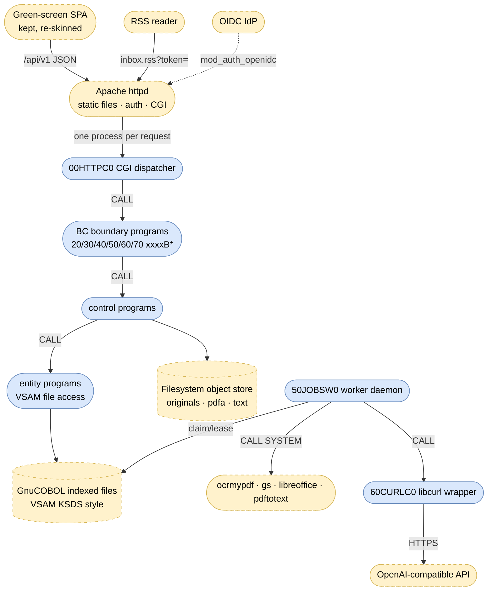

# Cloud DMS — Target Architecture (GNU COBOL)

> Companion to [`ARCHITECTURE.md`](ARCHITECTURE.md) (as-is). Iteration 1: this document
> plus `CLAUDE.md` fix the rules; no code yet. Behavior parity with the as-is system is
> the acceptance criterion — same `/api/v1` REST contract, same domain rules, same
> ingest semantics.

## 1. Target runtime topology

Two operating-system process types replace the Spring container:

1. **CGI request processes** — Apache spawns `00HTTPC0` per request; it parses the CGI
   environment, routes on `PATH_INFO`/`REQUEST_METHOD`, `CALL`s the matching boundary
   program with a neutral request/response copybook, and emits status, headers and JSON.
2. **Worker daemon** — `50JOBSW0` runs permanently (systemd/supervisor), polls the job
   file every 2 s, and drives the ingest pipeline exactly like today's `JobDispatcher`
   (claim with lease 300 s, batch 2, max 5 attempts, backoff 5 s·2ⁿ, lease sweep,
   deterministic rendition keys, graceful AI degradation).

## 2. Layering (BCE preserved)

| Layer | Suffix | Rule |
|-------|--------|------|
| Boundary | `B` | One program per REST resource; speaks only the request/response copybooks of the platform layer; enforces authorization; maps domain errors to status codes. Never reads CGI variables. |
| Control | `C` | Domain logic (validation, Aktenbildung, catalogs, prompt assembly, job orchestration). No I/O formats, no HTTP. |
| Entity | `E` | One program per VSAM file: OPEN/READ/WRITE/REWRITE/DELETE/START, key handling, locking. Record layouts as `R` copybooks. |
| Worker | `W` | Long-running daemons (job worker, backup). |

The generic platform (`00…`) owns: CGI env/stdin/stdout handling, URL decoding,
routing table, JSON parsing **and** generation (GnuCOBOL has `JSON GENERATE` but no
usable `JSON PARSE` — the parser is our own, one module), error-body emission with the
as-is status codes (400/403/404/409/413/415/422/502/503/504), paging, config from
environment variables, and multipart/form-data parsing for uploads.

## 3. Program inventory (initial cut)

Flat `src/`, names per the `NNMMMMLS` convention in `CLAUDE.md`:

| File | Replaces |
|------|----------|
| `00HTTPC0.cob` | Spring MVC dispatch: CGI env, routing, status/header emission |
| `00MPARC0.cob` | Multipart upload parsing |
| `00JSONC0.cob` | Jackson: JSON parse + generate |
| `00CONFC0.cob` | `application.yml`/`DmsProperties`: env-var config |
| `00ERRSC0.cob` | `ApiExceptionHandler`: error mapping |
| `00STORC0.cob` | `FilesystemObjectStore` (put/get, durable-before-metadata) |
| `10AUTHC0.cob` | `Authorization` + hierarchy role inheritance |
| `10AUDTE0.cob` | `AuditTrail` + audit file access |
| `10USERC0.cob` | `CurrentUser`/`UserProvisioning` (from Apache auth vars) |
| `20ORGSB0/C0/E0` | organization BC (orgs, users, members REST + logic + files) |
| `30DOCSB0/C0/E0` | documents BC (upload, list, get, file download, reprocess) |
| `30METAB0/C0` | metadata REST + validation + Aktenbildung |
| `30AKTEB0/E0` | Akten REST + file access |
| `30CLASB0/E0` | document classes |
| `40INDXC0.cob` | `SearchIndexer` (tokenize, write token index) |
| `40QRYB0…` → `40QURYB0.cob` | `SearchController`/`SearchQuery` (ACL-filtered) |
| `50JOBSB0.cob` | `JobsController` |
| `50JOBSE0.cob` | job queue file access (claim, lease, retry) |
| `50JOBSW0.cob` | `JobDispatcher` + scheduler (daemon) |
| `50CONVC0.cob` | Python conversion service: drives ocrmypdf/gs/libreoffice/pdftotext via `CALL "SYSTEM"`, temp files under the data dir |
| `60EXTRC0.cob` | Python extraction service: prompt assembly from catalogs, response parsing, suggestion validation |
| `60CURLC0.cob` | httpx: libcurl wrapper (`curl_easy_*` via `CALL`) |
| `60INTSB0/E0`, `60ORDNB0/E0` | intent + Ordnungsbegriff catalog REST/files |
| `70FEEDB0/C0/E0` | RSS feed, feed tokens (SHA-256/HMAC hashing) |
| `90BOOTW0.cob` | bootstrap/seeding (root org, admins, seed catalogs) |
| `90BAKW0…` → `90BACKW0.cob` | backup daemon (file snapshots, retention 72) |

Record layouts: one `R` copybook per VSAM file (`30DOCSR0.cpy`, `50JOBSR0.cpy`, …);
shared request/response and error copybooks under `00…R*.cpy`.

## 4. Data: SQLite → VSAM-style indexed files

One `ORGANIZATION IS INDEXED` file per table, primary key = today's primary key,
`ALTERNATE RECORD KEY` (with duplicates where needed) for today's secondary indexes
and unique constraints. Fixed-length records; timestamps stay epoch millis
(`PIC 9(13) COMP-3` or zoned); IDs stay 36-char UUID strings.

| File | Primary key | Alternate keys |
|------|-------------|----------------|
| `ORGUNIT` | id | path (unique), parent-id (dups) |
| `USERS` | id | email (unique) |
| `MEMBER` | id | user-id (dups), org-unit-id (dups), user+org (unique) |
| `DOCUMENT` | id | org-unit-id (dups), ingest-date (dups) |
| `DOCSTAT` | document-id | status (dups) |
| `RENDTION` | id | document-id+type (unique) |
| `AKTE` | id | file-plan-reference (unique) |
| `DOCMETA` | document-id | indexing-flag (dups) |
| `DOCFPR` | document-id | akte-id (dups) |
| `DOCORDNB` | id | document-id (dups), doc+type+value (unique) |
| `DOCINTNT` | document-id | — |
| `CONVJOB` | id | status+available-at (dups — claim scan), lease-until (dups — sweep) |
| `DOCCLASS` / `EXTRINT` / `EXTRINTF` / `ORDNTYPE` | id | name (unique; intent-id for fields) |
| `FEEDTOKN` | id | token-hash (unique), user-id (dups) |
| `AUDITLOG` | id | timestamp (dups) |

Rules carried over: `DOCORDNB.type-name` stays a snapshot (no referential check);
`AUDITLOG.user-id` is never validated against `USERS`; optimistic `version` numbers on
metadata are compared in the control layer (409 on mismatch).

**Concurrency**: CGI processes and the worker share files — every file is opened
`SHARING WITH ALL OTHER` with record locking (GnuCOBOL + Berkeley DB backend);
read-modify-rewrite cycles hold the record lock. The job claim (`READ` QUEUED with
`available_at <= now` → `REWRITE` RUNNING + lease) must be atomic under the record lock —
this replaces today's SQLite `UPDATE … WHERE` claim.

**Full-text search** (replaces FTS5): the indexer writes a token index file
`SRCHIDX` — key `token + org-unit-id + document-id` — from lower-cased, folded terms of
name, class, filePlanReference and content text (plus extracted fields/Ordnungsbegriffe,
as today). The query program STARTs on each query token, intersects document sets,
filters by the caller's visible org units **inside the scan** (ACL parity with S-1),
and ranks by hit count. A `DELETE`+rewrite per document keeps reindexing idempotent.
Prefix search via key START; no stemming (parity: FTS5 default tokenizer ≈ same level).

**Object store**: filesystem only — same keys (`originals/{id}/original`,
`renditions/{id}/pdfa.pdf`, `renditions/{id}/text.txt`) under the data dir. Write =
temp file + `rename()` + fsync for the durable-before-metadata guarantee; unwritable
store ⇒ 503 and no metadata, exactly as today. (S3 support: open decision D-2.)

## 5. Security in the target

- **Apache terminates authentication.** Production: `mod_auth_openidc` validates the
  session/bearer and exports claims (`OIDC_CLAIM_email`) into the CGI environment —
  replacing Spring's resource server. Dev: a trivial config trusts `X-Dev-User`
  (mirrors `DMS_SECURITY_MODE=dev`; the SPA sign-in overlay keeps working).
- `10USERC0` maps the authenticated e-mail to a `USERS` record (JIT provisioning,
  bootstrap admins from `DMS_BOOTSTRAP_ADMINS`), `10AUTHC0` enforces
  ADMIN/EDITOR/VIEWER with path-based inheritance, `10AUDTE0` writes the audit trail.
- Feed URL keeps token-in-query auth; hashing in COBOL (HMAC via libcrypto `CALL`,
  or own SHA-256 — decision D-4).
- The internal service token disappears — conversion/extraction are in-process `CALL`s.

## 6. The migrated Python services

- **Conversion (`50CONVC0`)**: same tool preference order and semantics as
  `services/conversion/app/convert.py` — PDFs through ocrmypdf (OCR + PDF/A), fallback
  ghostscript (`producer=ghostscript`), office/e-mail via libreoffice, images via
  ocrmypdf; `pdftotext` for the text; `passthrough` when no toolchain; tool timeouts ⇒
  job failure (worker retry), not 504 (the HTTP hop is gone — the 504 path remains only
  in the API error table for parity of documented codes).
- **Extraction (`60EXTRC0` + `60CURLC0`)**: prompt built from the DB catalogs (classes,
  intents + fields, active Ordnungsbegriff types) exactly as `prompt.py`; document
  transport modes `text` (default, 100 000-char cap) / `file` / image data-URL;
  `response_format: json_object`; parse + validate the model's JSON against the
  catalogs as `parsing.py` does. Unconfigured (`DMS_AI_TOKEN` empty) ⇒ skip ⇒
  `MANUAL_INDEXING`; transport/HTTP/parse errors ⇒ retry (3×, then give up for this
  run) ⇒ `REVIEW`. A COBOL state counter replaces the resilience4j circuit breaker
  (decision D-5).

## 7. Frontend: green-screen re-skin

Keep `index.html`, `js/` views, `api.js` contract untouched except styling hooks:

- New `app.css` theme: black background, phosphor green (`#33ff33`) primary, amber
  accent, monospace stack (`"IBM Plex Mono", "Courier New", monospace`), block-cursor
  input styling, scanline/undecorated tables, high-contrast focus.
- Stays **mobile-first**: existing off-canvas sidebar, responsive tables, touch targets.
- Served by Apache as static files from the doc root (no Spring static handler).

## 8. Configuration (environment)

`DMS_DATA_DIR`, `DMS_SECURITY_MODE` (`oidc`|`dev`), `DMS_BOOTSTRAP_ADMINS`,
`DMS_UPLOAD_MAX_BYTES` (104857600), worker knobs (`DMS_WORKER_*`: poll 2000 ms,
batch 2, max attempts 5, backoff base 5000 ms, lease 300 s), `DMS_AI_URL`,
`DMS_AI_TOKEN`, `DMS_AI_MODEL`, `DMS_AI_DOCUMENT_MODE`, `DMS_FEED_TOKEN_SECRET`,
`DMS_FEED_TOKEN_TTL_DAYS`, `DMS_BACKUP_*`. Health endpoint `GET /api/v1/health`
(worker heartbeat file + store writability + files openable) replaces the actuator
(decision D-6).

## 9. Migration iterations

1. **Docs only** (this iteration): CLAUDE.md, as-is + target architecture.
2. Platform layer `00…` + `10…` (CGI, JSON, config, errors, store, auth) + first
   vertical slice: organization BC end-to-end on VSAM, behind Apache.
3. documents + metadata + Akten + classes; upload path with durable-store rule.
4. conversion: job files, worker daemon, external tools in-process.
5. aiextraction: catalogs, libcurl client, prompt/parse; search: indexer + query.
6. feeds, backup/bootstrap, green-screen re-skin, parity test pass; decommission
   Java + Python + SQLite.

Each iteration keeps the old and new stacks behind the same API where feasible;
the parity checklist in `CLAUDE.md` gates every step.

## 10. Open decisions

| # | Decision | Status |
|---|----------|--------|
| D-1 | GnuCOBOL indexed-file backend (built-in ISAM vs. Berkeley DB) and its locking guarantees under concurrent CGI + daemon access | open |
| D-2 | S3 object-store support: drop (filesystem only) or re-add later via libcurl | leaning drop |
| D-3 | Multipart parsing limits & streaming for 100 MB uploads in a CGI process | open |
| D-4 | Crypto for SHA-256/HMAC: libcrypto via `CALL` vs. own implementation | leaning libcrypto |
| D-5 | Circuit-breaker parity for the AI path: shared state file vs. per-worker counter | open |
| D-6 | Health/readiness contract replacement for the Spring actuator | proposal in §8 |
| D-7 | RSS XML generation: template copybook vs. string build | open |
