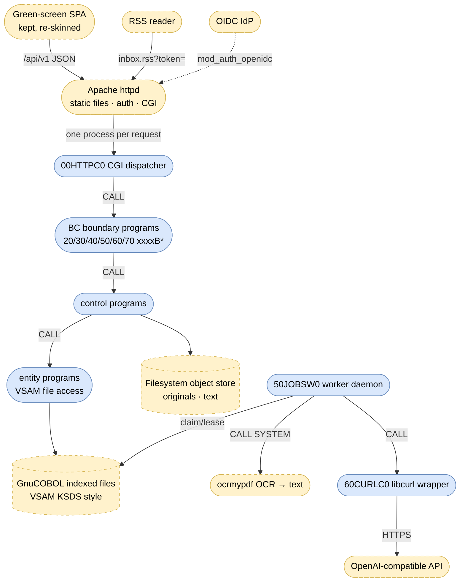

# Cloud DMS — Target Architecture (GNU COBOL)

> Companion to [`ARCHITECTURE.md`](ARCHITECTURE.md) (as-is). Iteration 1: this document
> plus `CLAUDE.md` fix the rules; no code yet. Behavior parity with the as-is system is
> the acceptance criterion — same `/api/v1` REST contract, same domain rules, same
> ingest semantics.

## 1. Target runtime topology

Two operating-system process types replace the Spring container:

1. **CGI request processes** — Apache spawns `00HTTPC0` per request; it parses the CGI
   environment, routes on `PATH_INFO`/`REQUEST_METHOD`, `CALL`s the matching boundary
   program with a neutral request/response copybook, and emits status, headers and JSON.
2. **Worker daemon** — `50JOBSW0` runs permanently (systemd/supervisor), polls the job
   file every 2 s, and drives the ingest pipeline exactly like today's `JobDispatcher`
   (claim with lease 300 s, batch 2, max 5 attempts, backoff 5 s·2ⁿ, lease sweep,
   deterministic rendition keys, graceful AI degradation).

## 2. Layering (BCE preserved)

| Layer | Suffix | Rule |
|-------|--------|------|
| Boundary | `B` | One program per REST resource; speaks only the request/response copybooks of the platform layer; enforces authorization; maps domain errors to status codes. Never reads CGI variables. |
| Control | `C` | Domain logic (validation, Aktenbildung, catalogs, prompt assembly, job orchestration). No I/O formats, no HTTP. |
| Entity | `E` | One program per VSAM file: OPEN/READ/WRITE/REWRITE/DELETE/START, key handling, locking. Record layouts as `R` copybooks. |
| Worker | `W` | Long-running daemons (job worker, backup). |

The generic platform (`00…`) owns: CGI env/stdin/stdout handling, URL decoding,
routing table, JSON parsing **and** generation (GnuCOBOL has `JSON GENERATE` but no
usable `JSON PARSE` — the parser is our own, one module), error-body emission with the
as-is status codes (400/403/404/409/413/415/422/502/503/504), paging, config from
environment variables, and multipart/form-data parsing for uploads.

## 3. Program inventory (initial cut)

Flat `src/`, names per the `NNMMMMLS` convention in `CLAUDE.md`:

| File | Replaces |
|------|----------|
| `00HTTPC0.cob` | Spring MVC dispatch: CGI env, routing, status/header emission |
| `00MPARC0.cob` | Multipart upload parsing |
| `00JSONC0.cob` | Jackson: JSON parse + generate |
| `00CONFC0.cob` | `application.yml`/`DmsProperties`: env-var config |
| `00ERRSC0.cob` | `ApiExceptionHandler`: error mapping |
| `00STORC0.cob` | `FilesystemObjectStore` (put/get, durable-before-metadata) |
| `00TIMEC0.cob` | epoch-millis → ISO-8601 instant (wire format for ingestDate) |
| `10AUTHC0.cob` | `Authorization` + hierarchy role inheritance |
| `10AUDTE0.cob` | `AuditTrail` + audit file access |
| `10USERC0.cob` | `CurrentUser`/`UserProvisioning` (from Apache auth vars) |
| `20ORGSB0/C0/E0` | organization BC (orgs, users, members REST + logic + files) |
| `30DOCSB0` + `30DOCSE0`/`30STATE0`/`30RENDE0` | documents BC boundary + DOCUMENT/DOCSTAT/RENDTION file access |
| `30METAB0` + `30METAC0`/`30METAE0`/`30FPRFE0`/`30ORDBE0`/`30INTNE0` | metadata REST + validation/save + its files |
| `30AKTEB0` + `30AKTBC0`/`30AKTEE0` | Akten REST + Aktenbildung control + file access |
| `30CLASB0` + `30VOCAC0`/`30CLASE0`, `30CONFB0` | document classes REST + vocabulary control + `/config` |
| `40INDXC0.cob` | `SearchIndexer` (tokenize, write token index) |
| `40QRYB0…` → `40QURYB0.cob` | `SearchController`/`SearchQuery` (ACL-filtered) |
| `50JOBSB0.cob` | `JobsController` |
| `50JOBSE0.cob` | job queue file access (claim, lease, retry) |
| `50JOBSW0.cob` | `JobDispatcher` + scheduler (daemon) |
| `50CONVC0.cob` | Conversion, **OCR-only** (D-9): ocrmypdf OCR via `CALL "SYSTEM"` produces the `TEXT` rendition, temp files under the data dir — no PDF/A, no ghostscript, no LibreOffice, no image path (PDF-only intake, D-8) |
| `60EXTRC0.cob` | Python extraction service: prompt assembly from catalogs, response parsing, suggestion validation |
| `60CURLC0.cob` | httpx: libcurl wrapper (`curl_easy_*` via `CALL`) |
| `60INTSB0/E0`, `60ORDNB0/E0` | intent + Ordnungsbegriff catalog REST/files |
| `70FEEDB0/C0/E0` | RSS feed, feed tokens (SHA-256/HMAC hashing) |
| `90BOOTW0.cob` | bootstrap/seeding (root org, admins, seed catalogs) |
| `90BAKW0…` → `90BACKW0.cob` | backup daemon (file snapshots, retention 72) |

Record layouts: one `R` copybook per VSAM file (`30DOCSR0.cpy`, `50JOBSR0.cpy`, …);
shared request/response and error copybooks under `00…R*.cpy`.

## 4. Data: SQLite → VSAM-style indexed files

One `ORGANIZATION IS INDEXED` file per table, primary key = today's primary key,
`ALTERNATE RECORD KEY` (with duplicates where needed) for today's secondary indexes
and unique constraints. Fixed-length records; timestamps stay epoch millis
(`PIC 9(13) COMP-3` or zoned); IDs stay 36-char UUID strings.

| File | Primary key | Alternate keys |
|------|-------------|----------------|
| `ORGUNIT` | id | path (unique), parent-id (dups) |
| `USERS` | id | email (unique) |
| `MEMBER` | id | user-id (dups), org-unit-id (dups), user+org (unique) |
| `DOCUMENT` | id | org-unit-id (dups), ingest-date (dups) |
| `DOCSTAT` | document-id | status (dups) |
| `RENDTION` | id | document-id+type (unique) |
| `AKTE` | id | file-plan-reference (unique) |
| `DOCMETA` | document-id | indexing-flag (dups) |
| `DOCFPR` | document-id | akte-id (dups) |
| `DOCORDNB` | id | document-id (dups), doc+type+value (unique) |
| `DOCINTNT` | document-id | — |
| `CONVJOB` | id | status+available-at (dups — claim scan), lease-until (dups — sweep) |
| `DOCCLASS` / `EXTRINT` / `EXTRINTF` / `ORDNTYPE` | id | name (unique; intent-id for fields) |
| `FEEDTOKN` | id | token-hash (unique), user-id (dups) |
| `AUDITLOG` | id | timestamp (dups) |

**Intake rule (PDF-only, D-8)**: upload validation accepts exactly one MIME type —
`application/pdf` (declared MIME or `.pdf` extension); everything else ⇒ 415. With
OCR-only conversion (D-9) the rendition **type** set is just `ORIGINAL` + `TEXT` (no
`PDF_A`), and `RENDTION.producer` values shrink to `upload | ocrmypdf`. Downloads serve
`ORIGINAL` (the default `type=PDF_A` request gracefully falls back to it, since no
PDF/A rendition is ever produced).

Rules carried over: `DOCORDNB.type-name` stays a snapshot (no referential check);
`AUDITLOG.user-id` is never validated against `USERS`; metadata `version` is
server-incremented and never supplied by the client (no optimistic-lock 409 — the
only 409 in the documents BC is a duplicate `DOCCLASS.name`).

**Concurrency**: CGI processes and the worker share files — every file is opened
`SHARING WITH ALL OTHER` with record locking (GnuCOBOL + Berkeley DB backend);
read-modify-rewrite cycles hold the record lock. The job claim (`READ` QUEUED with
`available_at <= now` → `REWRITE` RUNNING + lease) must be atomic under the record lock —
this replaces today's SQLite `UPDATE … WHERE` claim.

**Full-text search** (replaces FTS5): the indexer writes a token index file
`SRCHIDX` — key `token + org-unit-id + document-id` — from lower-cased, folded terms of
name, class, filePlanReference and content text (plus extracted fields/Ordnungsbegriffe,
as today). The query program STARTs on each query token, intersects document sets,
filters by the caller's visible org units **inside the scan** (ACL parity with S-1),
and ranks by hit count. A `DELETE`+rewrite per document keeps reindexing idempotent.
Prefix search via key START; no stemming (parity: FTS5 default tokenizer ≈ same level).

**Object store**: filesystem only — keys `originals/{id}/original` and (from the
conversion worker) `renditions/{id}/text.txt`; no `pdfa.pdf` (OCR-only, D-9). Under the
data dir. Write = temp file + `rename()` for the durable-before-metadata guarantee;
unwritable store ⇒ 503 and no metadata, exactly as today. (S3 dropped, D-2.)

## 5. Security in the target

- **Apache terminates authentication.** Production: `mod_auth_openidc` validates the
  session/bearer and exports claims (`OIDC_CLAIM_email`) into the CGI environment —
  replacing Spring's resource server. Dev: a trivial config trusts `X-Dev-User`
  (mirrors `DMS_SECURITY_MODE=dev`; the SPA sign-in overlay keeps working).
- `10USERC0` maps the authenticated e-mail to a `USERS` record (JIT provisioning,
  bootstrap admins from `DMS_BOOTSTRAP_ADMINS`), `10AUTHC0` enforces
  ADMIN/EDITOR/VIEWER with path-based inheritance, `10AUDTE0` writes the audit trail.
- Feed URL keeps token-in-query auth; hashing in COBOL (HMAC via libcrypto `CALL`,
  or own SHA-256 — decision D-4).
- The internal service token disappears — conversion/extraction are in-process `CALL`s.

## 6. The migrated Python services

- **Conversion (`50CONVC0`) — OCR-only (D-9)**: the PDF/A normalization of
  `services/conversion/app/convert.py` is **not migrated**. The step runs
  `ocrmypdf --skip-text` on the stored `ORIGINAL` (a born-digital text layer is reused,
  only image pages are OCR'd) to a scratch searchable PDF, then extracts plain text with
  `pdftotext -layout` (the port of `textextract.py`); if ocrmypdf is unavailable or
  rejects the file it falls back to `pdftotext` on the original. The text is stored
  durably as `renditions/{id}/text.txt` and upserted as the `TEXT` rendition
  (`producer=ocrmypdf`); the scratch PDF is discarded — **no PDF/A output, no ghostscript
  fallback, no `passthrough`, no LibreOffice/image path**. Both tools run via
  `CALL "SYSTEM"` with scratch files under `objects/tmp` (same filesystem as the store,
  so the final `rename` is atomic — R-1). An empty result is valid (a scanned page whose
  OCR yields nothing is still a success); a hard tool/storage failure ⇒ job failure
  (worker retry / terminal FAILED), not 504 (the HTTP hop is gone — the 504 path remains
  only in the API error table for parity of documented codes). `DMS_OCR_LANG`
  (default `deu+eng` in the image) selects the Tesseract language data.
- **Extraction (`60EXTRC0` + `60CURLC0`) — text-only (D-9), done (iteration 6)**: the
  prompt is built from the catalogs (document classes, active Ordnungsbegriff types,
  intents + fields) exactly as `prompt.py`; the document is always sent as the **OCR
  text** (100 000-char cap) — the `file` (inline PDF) and image data-URL transport modes
  are dropped, so `DMS_AI_DOCUMENT_MODE` goes away. `60CURLC0` POSTs
  `response_format: json_object` to `<DMS_AI_URL>/chat/completions` **through libcurl as
  a C library** (`curl_easy_*` via `CALL`, Bearer token, response captured to a scratch
  file with libcurl's default writer — no shell-out; the worker links `-lcurl` with
  `--no-as-needed`). `60EXTRC0` extracts `choices[0].message.content`, leniently parses
  the answer against the catalogs as `parsing.py` does (scalars via `00JSONC0`; the
  three-valued `ordnungsbegriffe` array walked object-by-object and canonicalized to
  active types), and prefills empty metadata (`extractedByAi`, never overwriting user
  rows, never forming Akten). Unconfigured (`DMS_AI_TOKEN` empty) or blank text ⇒ skip ⇒
  `MANUAL_INDEXING`; transport/HTTP error or malformed Ordnungsbegriff section ⇒
  `REVIEW`; none found ⇒ `MANUAL_INDEXING`. Retry/backoff is handled once, at the job
  level, by the worker (the resilience4j circuit breaker of decision D-5 is not
  reproduced — a failed extraction simply degrades that run). **Every extraction attempt
  is logged to the worker's stdout** (`60EXTRC0:` — the request URL/model + text/body
  sizes, and the outcome with HTTP status, detected class/intent/Ordnungsbegriff count
  or the skip/fail reason), so `docker logs` is the audit trail for AI calls.

## 7. Frontend: green-screen re-skin — done

`index.html`, the `js/` views and the `api.js` contract are **untouched**; the re-skin
is a pure rewrite of `css/app.css` (rule 2 — same views, navigation and REST calls):

- Token-driven theme: black background (`#050a05`), phosphor green (`#33ff66`,
  documented `#33ff33`) primary text with an amber (`#ffb000`) accent for active nav,
  primary buttons and panel headers; a system **monospace** stack
  (`ui-monospace … "IBM Plex Mono", "Courier New", monospace` — no external fonts, so it
  stays offline), sharp 2px corners, phosphor `text-shadow`/`box-shadow` glow, uppercase
  headers, green-bordered status badges (READY/DONE green, RECEIVED/CONVERTING/QUEUED/
  RUNNING amber, FAILED red), and a CRT flourish — a fixed scanline + vignette overlay
  (`body::before`, click-through) and a blinking block cursor after the view title.
- Stays **mobile-first**: the existing off-canvas sidebar (≤720px), panel-scrolled wide
  tables and `100dvh` layout carry over unchanged; `prefers-reduced-motion` disables the
  blink.
- Served by Apache as static files from the doc root (no Spring static handler).
- The document modal offers a **Download text** button (alongside Preview/Download/Retry)
  whenever a `TEXT` rendition exists, streaming `…/file?type=TEXT` as `<name>.txt`.
- Deferred: restricting the upload picker to `accept="application/pdf"` (a one-line
  markup tweak matching PDF-only intake, D-8) — kept out of this CSS-only pass.

## 8. Configuration (environment)

`DMS_DATA_DIR`, `DMS_SECURITY_MODE` (`oidc`|`dev`), `DMS_BOOTSTRAP_ADMINS`,
`DMS_UPLOAD_MAX_BYTES` (104857600), worker knobs (`DMS_WORKER_ENABLED` + `DMS_WORKER_*`:
poll 2000 ms, batch 2, max attempts 5, backoff base 5000 ms, lease 300 s),
`DMS_OCR_LANG` (Tesseract language data, default `deu+eng`), `DMS_AI_URL`,
`DMS_AI_TOKEN`, `DMS_AI_MODEL` (no `DMS_AI_DOCUMENT_MODE` — text-only, D-9),
`DMS_FEED_TOKEN_SECRET`, `DMS_FEED_TOKEN_TTL_DAYS`, `DMS_BACKUP_*`. Health endpoint
`GET /api/v1/health`
(worker heartbeat file + store writability + files openable) replaces the actuator
(decision D-6).

## 9. Migration iterations

1. **Docs only** — done: CLAUDE.md, as-is + target architecture.
2. **Platform + organization slice — done**: `00HTTPC0` (CGI dispatch, routing,
   status/JSON emission), `00JSONC0/00JSONC1` (JSON parse/escape), `00UUIDC0`,
   `10USERC0/10AUTHC0/10AUDTE0` (identity, path-inherited RBAC, audit file) and the
   full organization BC (`20ORGS*`, `20USRS*`, `20MEMB*`) on GnuCOBOL indexed files
   behind Apache `mod_cgid`; containerized (`cobol/Dockerfile`), smoked in CI
   (`.github/workflows/cobol-ci.yml` — builds the image, starts the container, runs
   `scripts/cobol-smoke.sh`) and wired into `compose.uat.yml` (originally on :7861
   alongside the Java stack; now the sole service on :7860 after decommission).
   Remaining platform pieces (`00MPARC0` multipart, `00STORC0` object store) land
   with the documents BC. Implementation note: under `mod_cgid` the CGI's stdin is a
   unix socket, so the request body is read via `CALL "read"` on fd 0 — not by
   reopening `/dev/stdin`.
3. **documents BC — done**: the object store (`00STORC0`, filesystem, temp-file +
   `rename` so the binary is durable before any record — R-1) and multipart parser
   (`00MPARC0`, streaming `read(2)` on fd 0, file part staged under `objects/tmp`,
   SHA-256 via `sha256sum`); the documents slice `30DOCS*` (upload/list/get/download/
   reprocess), `30META*` + `30VOCAC0`/`30AKTBC0`/`30METAC0` (metadata validation,
   controlled vocabulary, Aktenbildung), `30AKTEB0`, `30CLASB0`, `30CONFB0` on ten new
   indexed files (`DOCUMENT`, `DOCSTAT`, `RENDTION`, `AKTE`, `DOCMETA`, `DOCFPR`,
   `DOCORDNB`, `DOCINTNT`, `DOCCLASS`, `CONVJOB`). `90BOOTW0` seeds the six document
   classes. The dispatcher now parses the query string, routes multipart uploads
   through `00MPARC0`, and lets a boundary stream a raw response (`HX-EMITTED`: the
   file download writes headers via `write(2)` then the body via `cat`). Extended
   smoke covers upload/415/422/download-round-trip/metadata/Aktenbildung/classes/
   config/reprocess/ACL. Parity notes:
   - **No cross-file transaction.** The as-is upload commits Document + status + ORIGINAL
     rendition + job in one SQL transaction. VSAM has no such envelope, so the writes
     are ordered (binary first, then Document, status, rendition, job) and reprocess is
     idempotent (deterministic storage keys). A crash mid-sequence can leave a document
     without its job row; the worker's lease-sweep (iteration 4) plus reprocess recover
     it — same end state, weaker atomicity, acceptable for this single-node target.
   - **Metadata carries no optimistic lock / 409.** `version` is server-incremented and
     read-only to clients (matches the as-is code; the only 409 in the BC is a duplicate
     document-class name).
   - **`aiEnabled`** in `/config` reflects `DMS_AI_TOKEN` (the extraction service is
     gone; the LLM is called in-process in iteration 6), replacing the as-is
     "extraction URL configured" flag.
   - **Deferred:** deleting an org unit that still owns documents/Akten should be 409;
     the org-control delete guard currently checks only sub-units and members (the
     cross-BC document/akte count lands with the search index in iteration 5).
4. **conversion — done**: the in-process ingest worker daemon `50JOBSW0` (a
   long-running GnuCOBOL process, launched by `start.sh` alongside Apache, replacing
   the Spring scheduler) polls the durable `CONVJOB` queue and drives **OCR-only**
   conversion per job. New claim/lease ops on the job entity `50JOBSE0` (`CLAM` find +
   claim the earliest due `QUEUED` job — RUNNING, attempts+1, lease = now + lease·1000;
   `SWEP` re-queue jobs whose lease expired while RUNNING — R-2; `DONE`/`FAIL`/`RQUE`
   finish, terminal-fail, or retry-with-exponential-backoff; `SCAN` for the jobs view)
   carried through a shared control block `50JCTLR0`. The conversion control `50CONVC0`
   resolves the stored `ORIGINAL`, runs `ocrmypdf --skip-text` (born-digital PDFs pass
   through, scanned pages gain a text layer) then `pdftotext -layout` to extract plain
   text, stores `renditions/{id}/text.txt` (durable `rename`) and upserts the `TEXT`
   rendition (producer `ocrmypdf`) — **no PDF/A, no ghostscript ladder** (D-9);
   ghostscript is present only as ocrmypdf's transitive OCR engine, never invoked
   directly. Status walks RECEIVED → CONVERTING → READY, terminal FAILED after
   `DMS_WORKER_MAX_ATTEMPTS`. The read-only queue view `50JOBSB0` serves
   `GET /api/v1/jobs` (ACL-filtered by the job's document, active work first). The
   worker writes a `worker.heartbeat` file each poll. Extended smoke waits for an
   upload to reach READY, asserts the `TEXT` rendition + downloadable OCR text +
   `/jobs` DONE, and re-runs an idempotent reprocess. AI suggestions / `MANUAL_INDEXING`
   / `REVIEW` flagging and search reindex arrive with iterations 6 / 5 respectively;
   this iteration lands the document at READY with its text.
5. **search — deferred** (skipped for now at the product owner's request; the
   indexer + query on an own token-index file, plus the org-delete document/akte
   guard, land in a later pass).
6. **aiextraction — done**: the LLM is called **in-process via libcurl as a C
   library** (rule 6). `60CURLC0` CALLs `curl_easy_init/_setopt/_perform/_getinfo/
   _cleanup` to POST the OpenAI-compatible chat-completions request (Bearer auth,
   response captured with libcurl's built-in file writer, no shell-out to the curl
   binary); the worker binary links `-lcurl` (built with `--no-as-needed` because the
   symbols resolve at runtime). Three new catalog files — `EXTRINTENT`, `INTFIELD`,
   `ORDNTYPE` (`60INTNE0`/`60INFDE0`/`60ORDTE0`), seeded by `90BOOTW0` with the
   Rechnungseingang intent + fields and the Kundennummer/Vertragsnummer types. The
   extraction control `60EXTRC0` (port of MetadataExtraction + ExtractionPrompt + the
   parse half of AiExtractionClient + MetadataValidation.applySuggestions/
   flagForIndexing) assembles the system prompt from the document-class,
   Ordnungsbegriff-type and intent/field catalogs, sends the document as its **OCR
   text only** (D-9, 100 000-char cap), leniently parses the JSON answer
   (documentClass, documentDate, filePlanReference, intent + its fields, and the
   three-valued `ordnungsbegriffe` array), and prefills empty metadata
   (`extractedByAi`, never overwriting user rows, never forming Akten). Graceful
   degradation (§5 QG-1): unconfigured (`DMS_AI_TOKEN` unset) or blank text ⇒
   `MANUAL_INDEXING`, a transport/HTTP error ⇒ `REVIEW`, a malformed Ordnungsbegriff
   section ⇒ `REVIEW`, none found ⇒ `MANUAL_INDEXING` — the document still reaches
   READY. Wired into `50CONVC0` after the TEXT rendition. Smoke asserts the
   unconfigured path (document READY + `MANUAL_INDEXING`). **Deferred:** the
   catalog-management REST boundaries (`/api/v1/intents`,
   `/api/v1/ordnungsbegriff-types`) — the catalog is seeded and drives extraction;
   runtime CRUD of intents/types is a follow-up.
7. **green-screen re-skin — done** (§7): `css/app.css` rewritten as the phosphor-green/
   amber terminal theme, mobile-first, views/markup/REST untouched.
8. **decommission — done**: the product owner declared the system **feature-complete**;
   the search BC, the RSS feeds BC and the backup/operations hardening will **not** be
   built. The legacy Java module (`dms/`) and the Python services (`services/`) have been
   **deleted** from the repository, the JS frontend relocated to `web/`, and the compose
   files + CI collapsed to the single GNU COBOL service on :7860. `docs/ARCHITECTURE.md`
   is retained as a historical record of the removed stack.

Earlier iterations kept the old and new stacks behind the same API for comparison; with
the migration complete the COBOL stack now stands alone.

## 10. Open decisions

| # | Decision | Status |
|---|----------|--------|
| D-1 | GnuCOBOL indexed-file backend (built-in ISAM vs. Berkeley DB) and its locking guarantees under concurrent CGI + daemon access | open |
| D-2 | S3 object-store support: drop (filesystem only) or re-add later via libcurl | **decided 2026-07-18** — filesystem `00STORC0` implemented (`$DMS_DATA_DIR/objects`, temp-file + `rename`); S3 dropped |
| D-3 | Multipart parsing limits & streaming for 100 MB uploads in a CGI process | **decided 2026-07-18** — `00MPARC0` buffers the body via `read(2)` and stages the file part to disk; 413 pre-check on `CONTENT_LENGTH`. A future streaming refinement can avoid the full in-memory body |
| D-4 | Crypto for SHA-256/HMAC: libcrypto via `CALL` vs. own implementation | leaning libcrypto; interim: `sha256sum` CLI in `00MPARC0` |
| D-5 | Circuit-breaker parity for the AI path: shared state file vs. per-worker counter | open |
| D-6 | Health/readiness contract replacement for the Spring actuator | proposal in §8 |
| D-7 | RSS XML generation: template copybook vs. string build | open |
| D-8 | **PDF-only intake**: only `application/pdf` accepted (415 otherwise); LibreOffice and the image-OCR path are out of migration scope | **decided 2026-07-17** |
| D-9 | **OCR-only conversion, text-only AI**: input is always PDF, so no PDF/A normalization — the conversion step just OCRs (ocrmypdf) to the `TEXT` rendition (no ghostscript/passthrough). Rendition types = `ORIGINAL` + `TEXT`; AI receives only the OCR text (`DMS_AI_DOCUMENT_MODE` dropped) | **decided 2026-07-18** |
